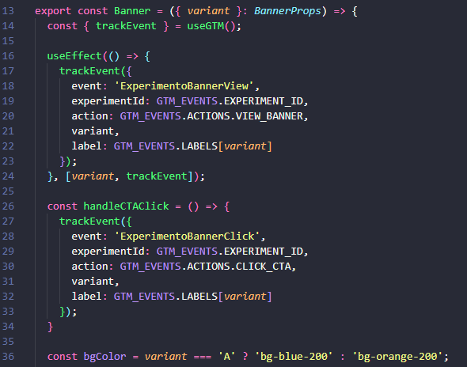
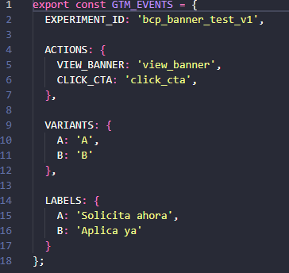
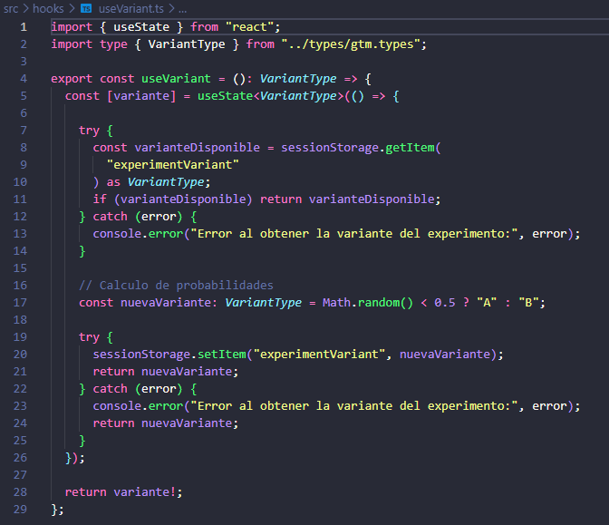
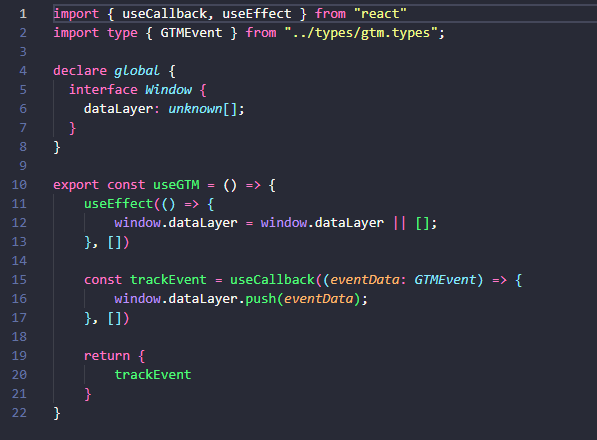

# Landing Page Experimental - Tarjetas de Crédito BCP

**Postulante:** Richard David Nicolas Flores 
**Fecha de entrega:** 20/04/2026

## Descripción del Proyecto

Este proyecto consiste en una **landing page experimental** desarrollada en **React** para el Banco de Crédito del Perú (BCP). Su objetivo principal es validar una hipótesis de **optimización de la tasa de clics (CTR)** enfocada en el formulario de solicitud de tarjetas de crédito.

Para lograrlo, la aplicación implementa un **Test A/B dinámico** en el banner principal y realiza un seguimiento detallado de las interacciones del usuario mediante la integración con **Google Tag Manager (GTM)**.

El diseño y la interfaz toman como referencia la experiencia digital oficial del BCP ([Tarjetas de Crédito BCP](https://www.viabcp.com/tarjetas/tarjetas-credito)), replicando de manera fiel su estructura modular:
- **Navegación superior:** Header con menú principal.
- **Banner interactivo:** Hero section sujeto al experimento A/B.
- **Sección de beneficios:** Catálogo de tarjetas destacadas.
- **Formulario de solicitud:** Sección enfocada en la captación de leads.
- **Pie de página:** Footer con enlaces corporativos.

## Hipótesis y Objetivo del Experimento

### Hipótesis
💡 **"Modificar el color y mensaje del banner principal puede aumentar el porcentaje de clics (CTR) hacia el formulario de solicitud."**


### Objetivo
Desarrollar una landing experimental que permita validar la hipótesis mediante un test A/B, registrando eventos clave en GTM para análisis posterior. El experimento compara dos variantes del banner:
- **Variante A**: Fondo azul con CTA "Solicita ahora"
- **Variante B**: Fondo naranja con CTA "Aplica ya"

La variante se asigna aleatoriamente por sesión de usuario (50/50), persistiendo durante la navegación.

## Tecnologías Utilizadas

- **React 19** con TypeScript
- **Vite** para build y desarrollo
- **Tailwind CSS** para estilos
- **shadcn/ui** para componentes UI (NavigationMenu, Button, etc.)
- **React Icons** para íconos
- **Sonner** para notificaciones toast
- **Google Tag Manager** para tracking de eventos
- **ESLint** y **TypeScript** para calidad de código

## Estructura del Proyecto

```
src/
├── components/
│   ├── UtilityBar.tsx      # Barra superior (Personas/PyMES/Empresas)
│   ├── MainNavigation.tsx  # Header con logo y navegación
│   ├── Banner.tsx          # Banner principal con variante A/B
│   ├── BenefitSection.tsx  # Sección de beneficios (3 tarjetas)
│   ├── FormSection.tsx     # Contenedor del formulario
│   ├── FormItem.tsx        # Formulario de nombre y email
│   ├── Footer.tsx          # Footer con enlaces
│   └── index.ts            # Exports de componentes
├── hooks/
│   ├── useVariant.ts       # Hook para asignar variante A/B
│   └── useGTM.ts           # Hook para tracking GTM
├── constants/
│   └── gtm-events.ts       # Constantes de eventos GTM
├── types/
│   └── gtm.types.ts        # Tipos TypeScript para GTM
├── styles/
│   ├── index.css           # Estilos Tailwind y colores BCP
│   └── fonts.css           # Fuentes Flexo
├── AppPruebaTecnica.tsx    # Componente principal
└── main.tsx                # Punto de entrada
```
## Cómo Ejecutar el Proyecto

### Prerrequisitos
- Node.js (versión 18 o superior)
- npm o yarn

### Instalación
```bash
# Clonar el repositorio
git clone https://github.com/DavidNicolasDev/caso-practico-neo.git
cd caso-practico-neo

# Instalar dependencias
npm install

# Ejecutar en modo desarrollo
npm run dev

# Build para producción
npm run build

# Preview del build
npm run preview
```

La aplicación se ejecutará en `http://localhost:5173` por defecto.

## Análisis Detallado del Código

### Arquitectura General
La aplicación sigue una arquitectura de componentes modulares con separación clara de responsabilidades:
- **Componentes**: Cada sección de la landing es un componente independiente.
- **Hooks personalizados**: `useVariant` para lógica de A/B testing, `useGTM` para tracking.
- **Constantes y tipos**: Centralización de configuración GTM y tipado fuerte.

### Componentes Principales

#### AppPruebaTecnica.tsx
Actúa como el **componente raíz (`AppCasoPractico`)** que estructura y orquesta la renderización de toda la landing page.

**Responsabilidades principales:**
- **Gestión del Experimento:** Utiliza el custom hook `useVariant` para inicializar o recuperar la variante (A o B) asignada a la sesión y la inyecta como prop al componente `<Banner />`.
- **Composición del Layout:** Ensambla ordenadamente todos los módulos de la interfaz gráfica (`UtilityBar`, `MainNavigation`, `BenefitSection`, `FormSection` y `Footer`).
- **Notificaciones globales:** Incorpora el componente `<Toaster />` (de la librería Sonner) para habilitar el sistema de alertas (toasts) en toda la aplicación.

```tsx
export default function AppCasoPractico() {
    const variante = useVariant();
    return(
        <>
            <UtilityBar/>
            <MainNavigation/>
            <Banner variant={variante}/>
            <BenefitSection/>
            <FormSection/>
            <Footer/>
            <Toaster richColors />
        </>
    )
}
```

#### Banner.tsx (Banner A/B)
Es el **componente central del experimento A/B**. Recibe la variante asignada (`A` o `B`) mediante *props* y adapta de forma dinámica tanto su apariencia visual como el texto de su botón de acción (CTA).

**Características y responsabilidades clave:**
- **Renderizado Dinámico:** Intercambia la clase CSS de fondo (`bg-blue-200` o `bg-orange-200`) y extrae el texto del CTA directamente desde el diccionario de constantes `GTM_EVENTS.LABELS`.
- **Tracking de Impresión (`view_banner`):** Emplea un `useEffect` integrado con el hook `useGTM` para disparar automáticamente el evento `ExperimentoBannerView` al dataLayer en cuanto el componente es montado y visible para el usuario.
- **Tracking de Interacción (`click_cta`):** Captura los clics a través de la función `handleCTAClick`, enviando el evento `ExperimentoBannerClick` a GTM con todos los parámetros de contexto necesarios (`experimentId`, `variant`, `action`, `label`).
- **Diseño Responsivo:** Estructura optimizada para adaptarse a dispositivos *mobile* y *desktop*, garantizando que la experiencia visual del experimento sea impecable en cualquier pantalla.

```tsx
export const Banner = ({ variant }: BannerProps) => {
  const { trackEvent } = useGTM();

  useEffect(() => {
    trackEvent({
      event: 'ExperimentoBannerView',
      experimentId: GTM_EVENTS.EXPERIMENT_ID,
      action: GTM_EVENTS.ACTIONS.VIEW_BANNER,
      variant,
      label: GTM_EVENTS.LABELS[variant]
    });
  }, [variant, trackEvent]);

  const handleCTAClick = () => {
    trackEvent({
      event: 'ExperimentoBannerClick',
      experimentId: GTM_EVENTS.EXPERIMENT_ID,
      action: GTM_EVENTS.ACTIONS.CLICK_CTA,
      variant,
      label: GTM_EVENTS.LABELS[variant]
    });
  }

  const bgColor = variant === 'A' ? 'bg-blue-200' : 'bg-orange-200';


  return (
    <section className={`${bgColor} w-full`}>
      <a onClick={handleCTAClick}
      className="space-x-2 ....">   
        <p className="inline-block">
          {GTM_EVENTS.LABELS[variant]}
        </p>    
      </a>
    </section>
  );
};
```

#### BenefitSection.tsx
Es el componente encargado de mostrar el **catálogo de tarjetas de crédito destacadas** (Visa Clásica, Visa Oro y Visa Platinum LATAM Pass).

**Características principales:**
- **Renderizado por Mapeo:** Utiliza una estructura de datos interna (`cardsData`) para iterar y generar dinámicamente el contenido, lo que facilita el mantenimiento del catálogo.
- **Diseño de Tarjetas (Cards):** Cada tarjeta renderiza una imagen destacada, el título del producto, una lista de beneficios (usando iconos `FaCheck` de React Icons) y botones de llamado a la acción ("Pídela aquí" y "Ver detalle").
- **Experiencia Visual y Responsive:** Implementa una cuadrícula (CSS Grid) que se adapta fluidamente a cualquier dispositivo (móvil, tablet, escritorio) y añade microinteracciones, como un sutil efecto de escalado en las imágenes y sombras al hacer *hover*.

#### FormSection.tsx y FormItem.tsx
Formulario simple con validación básica:
- Campos: nombre (texto) y email (email)
- Validación: campos no vacíos
- Feedback: toasts de éxito/error usando Sonner
- Reset del formulario tras envío exitoso

```tsx
export const FormItem = () => {
  const [formData, setFormData] = useState({ name: "", email: "" });

  const handleSubmit = (e: React.FormEvent<HTMLFormElement>) => {
    e.preventDefault();

    if(formData.name === "" || formData.email === "") {
      toast.warning("Por favor, completa todos los campos");
      return;
    }

    toast.success("Formulario enviado");
    setFormData({ name: "", email: "" });
  };

  return (
    <form onSubmit={handleSubmit}>
      <input type="text" placeholder="Nombre" value={formData.name} onChange={(e) => setFormData({ ...formData, name: e.target.value })} />
      <input type="email" placeholder="Correo" value={formData.email} onChange={(e) => setFormData({ ...formData, email: e.target.value })} />
      <button type="submit">Enviar</button>
    </form>
  );
};
```
### Hooks Personalizados

#### useVariant.ts
Gestiona la asignación y persistencia de la variante A/B:
- **Lógica**: Asigna variante aleatoria (50/50) si no existe en sessionStorage.
- **Persistencia**: Usa sessionStorage para mantener la variante durante la sesión.
- **Tipado**: Retorna `VariantType` ('A' | 'B').

```tsx
export const useVariant = (): VariantType => {
  const [variante] = useState<VariantType>(() => {
    try {
      const varianteDisponible = sessionStorage.getItem("experimentVariant") as VariantType;
      if (varianteDisponible) return varianteDisponible;
    } catch (error) {
      console.error("Error al obtener la variante del experimento:", error);
    }

    const nuevaVariante: VariantType = Math.random() < 0.5 ? "A" : "B";

    try {
      sessionStorage.setItem("experimentVariant", nuevaVariante);
      return nuevaVariante;
    } catch (error) {
      console.error("Error al obtener la variante del experimento:", error);
      return nuevaVariante;
    }
  });

  return variante!;
};
```

#### useGTM.ts
Hook para integración con Google Tag Manager:
- Inicializa `window.dataLayer` en useEffect.
- Proporciona función `trackEvent` para enviar eventos a GTM.

```tsx
export const useGTM = () => {
  useEffect(() => {
    window.dataLayer = window.dataLayer || [];
  }, []);

  const trackEvent = useCallback((eventData: GTMEvent) => {
    window.dataLayer.push(eventData);
  }, []);

  return { trackEvent };
};
```

## Requisitos de la Prueba Técnica - Tracking GTM

Según las especificaciones de la prueba, se deben implementar eventos clave en GTM utilizando `window.dataLayer.push()`. El ejemplo orientativo proporcionado es:

```javascript
// Generamos el objeto que captura los eventos
window.dataLayer = window.dataLayer || [];
// Sintaxis para los eventos
dataLayer.push({
  event: 'experiment_event',
  experimentId: 'bcp_banner_test_v1',
  action: 'click_cta',
  variant: 'A',
  label: 'Solicita ahora'
});
```

**Notas de implementación:**
- El valor de `variant` cambia entre 'A' y 'B' según la versión del banner.
- La estructura mantiene nombres claros para interpretación en GTM.

### Tracking con Google Tag Manager

#### Eventos Implementados
1. **Vista del banner** (`view_banner`): Se dispara automáticamente cuando el usuario ve el banner.
2. **Clic en CTA** (`click_cta`): Se dispara cuando el usuario hace clic en el botón de acción.

#### Estructura de Eventos
Cada evento sigue el formato especificado:
```javascript
dataLayer.push({
  event: 'ExperimentoBannerView', // o 'ExperimentoBannerClick'
  experimentId: 'bcp_banner_test_v1',
  action: 'view_banner', // o 'click_cta'
  variant: 'A', // o 'B'
  label: 'Solicita ahora' // o 'Aplica ya'
});
```
#### Constantes y Tipos
- **gtm-events.ts**: Define IDs, acciones y labels constantes.
- **gtm.types.ts**: Tipos TypeScript para eventos GTM.

### Estilos y Diseño
- **Tailwind CSS**: Framework principal para estilos responsivos.
- **Colores BCP**: Definidos en variables CSS personalizadas (`--color-m-blue`, `--color-m-orange`, etc.).
- **Fuentes**: Familia Flexo importada desde archivos WOFF2.
- **Responsive**: Diseño mobile-first con breakpoints para tablet y desktop.


## Implementación del Tracking GTM

### Captura del Código
El código clave para el tracking se encuentra en `BenefitSection.tsx`:

```tsx
// Tracking de vista del banner
useEffect(() => {
  trackEvent({
    event: 'ExperimentoBannerView',
    experimentId: GTM_EVENTS.EXPERIMENT_ID,
    action: GTM_EVENTS.ACTIONS.VIEW_BANNER,
    variant,
    label: GTM_EVENTS.LABELS[variant]
  });
}, [variant, trackEvent]);

// Tracking de clic en CTA
const handleCTAClick = () => {
  trackEvent({
    event: 'ExperimentoBannerClick',
    experimentId: GTM_EVENTS.EXPERIMENT_ID,
    action: GTM_EVENTS.ACTIONS.CLICK_CTA,
    variant,
    label: GTM_EVENTS.LABELS[variant]
  });
};
```

### Configuración en GTM
Para conectar con un contenedor GTM real:
1. Crear triggers para eventos personalizados (`ExperimentoBannerView`, `ExperimentoBannerClick`).
2. Configurar variables para capturar `experimentId`, `action`, `variant`, `label`.
3. Crear tags para enviar datos a Google Analytics 4 o herramientas de análisis.

## Documentación Visual de la Implementación

Esta sección incluye capturas y diagramas que ilustran los aspectos clave de la implementación del experimento A/B y el tracking con Google Tag Manager.

### Aplicación del Push a GTM

*Captura que muestra cómo se realiza el push de eventos al dataLayer de GTM.*

### Definiciones de Constantes y Eventos

*Diagrama de las constantes definidas para los eventos GTM y sus valores.*


### Hook para Manejo de Variantes

*Ilustración del hook `useVariant` que gestiona la asignación aleatoria de variantes A/B.*

### Hook useGTM

*Diagrama del hook `useGTM` responsable de la inicialización del dataLayer y el envío de eventos.*

## Despliegue en GitHub Pages

### URL Accesible
[https://davidnicolasdev.github.io/caso-practico-neo](https://davidnicolasdev.github.io/caso-practico-neo)

### Cómo Desplegar
```bash
# Instalar gh-pages
npm install --save-dev gh-pages

# Agregar scripts en package.json
"scripts": {
  "predeploy": "npm run build",
  "deploy": "gh-pages -d dist"
}

# Desplegar
npm run deploy
```
## Repositorio en GitHub

### URL del Repositorio
[https://github.com/DavidNicolasDev/caso-practico-neo](https://github.com/DavidNicolasDev/caso-practico-neo)

### Commits Detallados por Etapa
#### Etapa 1: Construcción de la landing

- `feat: inicializar proyecto con Vite, React y Tailwind`

- `feat: implementar estructura de componentes (NavBar, Footer)`

- `feat: crear HeroSection y Cards de beneficios`

- `feat: desarrollar FormSection con validación básica`

- `feat: integrar branding BCP (fuentes Flexo y assets)`

#### Etapa 2: Implementación del tracking en GTM

- `feat: configurar hook useGTM y constantes de eventos`

- `feat: implementar hook useVariant para lógica de A/B testing`

- `feat: integrar tracking de visualización y clics en HeroSection`

- `feat: vincular variantes A/B con estilos y textos dinámicos`

#### Etapa 3: Optimizaciones y despliegue

- `feat: añadir notificaciones toast y mejora de responsive`

- `feat: configurar linting, TypeScript y entorno de producción`

- `feat: preparar despliegue en GitHub Pages`

- `docs: redactar README con análisis del proyecto`

## Conclusión

El desarrollo de esta **landing page experimental** cumple con el objetivo de habilitar la validación de la hipótesis de CTR mediante un **Test A/B dinámico**. La aplicación es completamente funcional y ha sido construida siguiendo las mejores prácticas de **React**, destacando por su modularidad, tipado fuerte con **TypeScript** y una clara separación de responsabilidades.

Los eventos GTM registrados permiten medir efectivamente el impacto de las variantes en el CTR, proporcionando datos para tomar decisiones basadas en evidencia sobre la optimización de conversión.

**Estado del experimento**: Listo para despliegue, recolección de datos y análisis de resultados en entorno de producción.
